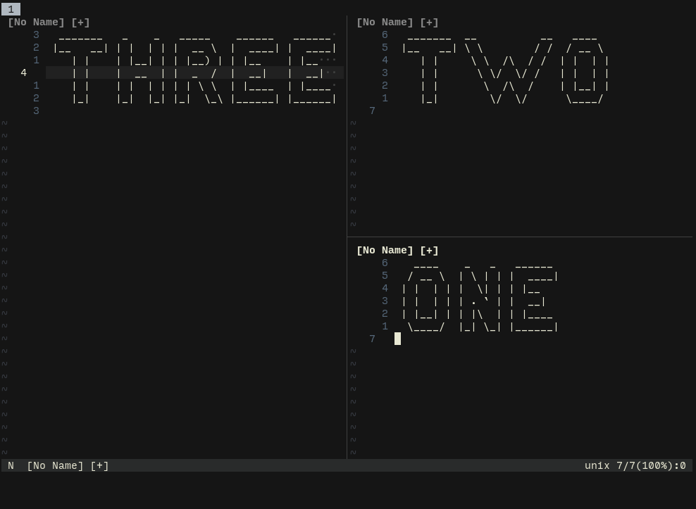

# swap-split.nvim

A plugin for NVIM to help you easily swap your split buffers.



## Installation

Install using your favorite package manager.

Packer:
`use 'xorid/swap-split.nvim'`

## Configuration

While it's not required to use swap-split, you can call the setup funciton if you wish to make any changes to the default settings. Currently, there is only one option, which is the filetypes you want to ignore.

```lua
-- Default settings
require("swap-split").setup({
    ignore_filetypes = {
        "NvimTree"
    }
})
```

### Keybinds

The swap function is unbound by default. You can either bind it to the command `:SwapSplit` or as a lua call `require('swap-split').swap()`

Vimscript:
```
nnoremap <leader>S <cmd>SwapSplit<CR>
" -- or --
nnoremap <leader>S <cmd>lua require("swap-split").swap()<CR>
```

Lua:
```lua
local map = vim.api.nvim_set_keymap
map('n', '<leader>S', '<cmd>SwapSplit<CR>', { noremap = true })
-- or --
local map = vim.api.nvim_set_keymap
map('n', '<leader>S', '<cmd>lua require("swap-split").swap()<CR>', { noremap = true })
```

### Selector Color
Customize this by setting the color of the highlight group `SwapSplitStatusLine`.

For example:

`hi SwapSplitStatusLine guifg=#000000 fuibg=#ff8383`
